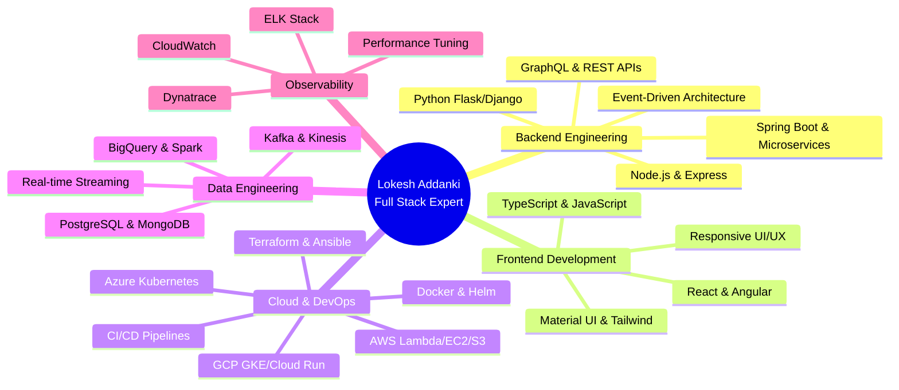
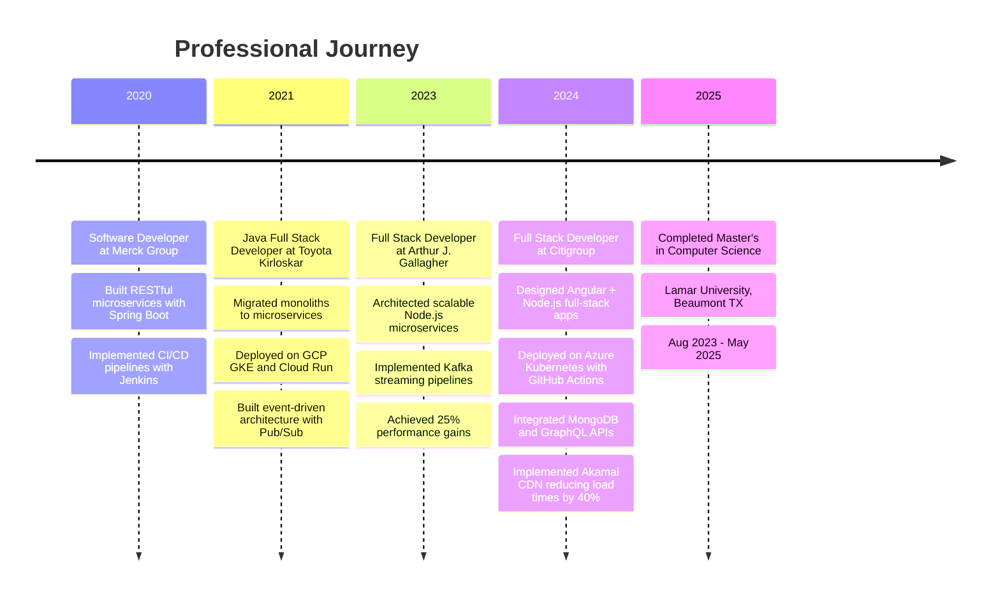

<!-- 
██╗      ██████╗ ██╗  ██╗███████╗███████╗██╗  ██╗     █████╗ ██████╗ ██████╗  █████╗ ███╗   ██╗██╗  ██╗██╗
██║     ██╔═══██╗██║ ██╔╝██╔════╝██╔════╝██║  ██║    ██╔══██╗██╔══██╗██╔══██╗██╔══██╗████╗  ██║██║ ██╔╝██║
██║     ██║   ██║█████╔╝ █████╗  ███████╗███████║    ███████║██║  ██║██║  ██║███████║██╔██╗ ██║█████╔╝ ██║
██║     ██║   ██║██╔═██╗ ██╔══╝  ╚════██║██╔══██║    ██╔══██║██║  ██║██║  ██║██╔══██║██║╚██╗██║██╔═██╗ ██║
███████╗╚██████╔╝██║  ██╗███████╗███████║██║  ██║    ██║  ██║██████╔╝██████╔╝██║  ██║██║ ╚████║██║  ██╗██║
╚══════╝ ╚═════╝ ╚═╝  ╚═╝╚══════╝╚══════╝╚═╝  ╚═╝    ╚═╝  ╚═╝╚═════╝ ╚═════╝ ╚═╝  ╚═╝╚═╝  ╚═══╝╚═╝  ╚═╝╚═╝
-->

<div align="center">

</div>

<div align="center">


</div>

```bash
┌─[lokesh@terminal]─[~/professional_identity]
└──╼ $ whoami
Lokesh Addanki • Full Stack Developer • Cloud Native Architect

┌─[lokesh@terminal]─[~/achievements]
└──╼ $ ls -la
drwxr-xr-x  5 years of enterprise experience
drwxr-xr-x  4 enterprise employers across US and India
-rw-r--r--  40% performance improvement average
-rw-r--r--  175+ technologies across the stack
-rw-r--r--  4 industry domains (Finance • Insurance • Automotive • Healthcare)
```

<div align="center">

<table>
<tr>
<td></td>
<td></td>
</tr>
</table>

[](https://github.com/codeknightadloky-ai)
[](https://lokeshaddanki.com)

</div>

---

## 🎯 Professional Identity

I'm a **Full Stack Developer** with **5 years of battle-tested experience** architecting and delivering cloud-native microservices and responsive front-end applications across **finance, insurance, and automotive** domains. My expertise lies in **migrating legacy monoliths** to containerized **Node.js and Spring Boot services** on **Azure Kubernetes** and **GKE**, consistently achieving **30% increases in system uptime** and **25% reductions in latency**.

I specialize in building **event-driven architectures** using **Kafka**, **Kinesis**, and **Pub/Sub**, designing **REST and GraphQL APIs** that scale to millions of requests, and leading **cross-functional teams** through **CI/CD pipeline transformations** using **GitHub Actions**, **Jenkins**, and **ArgoCD**. My work has accelerated release cadences by **50%** while improving system reliability through health checks, retries, and fault-tolerant design.



<table width="100%">
<tr>
<td width="50%" valign="top">

```typescript
class LokeshAddanki implements FullStackEngineer {
  private expertise: TechStack = {
    languages: [
      "Java 8+", "J2EE", "Python", "Node.js",
      "TypeScript", "Kotlin", "Scala", "C/C++"
    ],
    frameworks: {
      backend: [
        "Spring Boot", "Express.js", 
        "Django", "Flask", "Ruby on Rails"
      ],
      frontend: [
        "React", "Angular 11+", 
        "Vue.js", "React Native"
      ]
    },
    cloud: [
      "AWS (Lambda, EC2, S3, ECS, Kinesis)",
      "GCP (GKE, Cloud Run, Pub/Sub, BigQuery)",
      "Azure (K8s, AD, CloudFormation)",
      "PCF", "OpenShift"
    ],
    databases: [
      "PostgreSQL", "MongoDB", "DynamoDB",
      "Oracle", "DB2", "Cassandra"
    ]
  };
  
  public getSpecialty(): string[] {
    return [
      "Microservices Architecture",
      "Event-Driven Systems",
      "Cloud-Native Applications",
      "CI/CD Pipeline Optimization",
      "Performance Engineering"
    ];
  }
}
```

</td>
<td width="50%" valign="top">

```python
achievement_matrix = {
    'experience_years': 5,
    'system_uptime_improvement': '30%',
    'latency_reduction': '25%',
    'deployment_time_reduction': '50%',
    'page_load_improvement': '40%',
    'user_engagement_boost': '20%',
    
    'domains': [
        'Finance (Citigroup)',
        'Insurance (Arthur J. Gallagher)',
        'Automotive (Toyota Kirloskar)',
        'Healthcare (Merck Group)'
    ],
    
    'certifications': [
        'AWS Certified Developer - Associate',
        'Oracle Certifications: Java Focused'
    ],
    
    'leadership': {
        'teams_mentored': 'cross-functional engineers',
        'architecture_reviews': 'Weekly',
        'incident_response': 'On-call rotation lead'
    }
}
```

</td>
</tr>
</table>

---

## 📊 Impact Metrics Dashboard

<div align="center">

<table>
<tr>
<td align="center">

</td>
<td align="center">

</td>
<td align="center">

</td>
</tr>
<tr>
<td align="center">

</td>
<td align="center">

</td>
<td align="center">

</td>
</tr>
</table>

</div>



---

## 💼 Professional Experience

<table width="100%">
<tr>
<td width="50%" valign="top">

### 🚀 Full Stack Developer
**`Citigroup • May 2024—Present`**


- **Architected scalable microservices** using **Node.js**, **GraphQL**, and **MongoDB** with event-driven architecture, resulting in **30% increase in system uptime** and **25% reduction in latency**
- **Designed and deployed** full-stack applications using **Angular**, **Node.js**, and **REST APIs** on **Azure Kubernetes**, implementing **OAuth2** and **RBAC** for enterprise security
- **Optimized BigQuery data pipelines** for analytics workloads, improving reliability with health checks, retries, and fault-tolerant design patterns
- **Implemented Akamai CDN** setup for content delivery, achieving **40% reduction in page load times** and **20% increase in user engagement**
- **Developed Linux/Unix shell scripts** for automated Azure K8s cluster deployment, reducing deployment time by **50%** and increasing system reliability by **30%**
- **Built API-first microservices** with **Node.js** and **Python** supporting state transitions and business rule processing using **Drools**
- **Established observability** using **CloudWatch** and **ELK stack**, creating dashboards and performing root cause analysis to reduce incident resolution time

</td>
<td width="50%" valign="top">

### 🏢 Full Stack Developer
**`Arthur J. Gallagher & Co • Nov 2023—Apr 2024`**


- **Developed microservices and REST APIs** using **Spring Boot**, **Spring MVC**, and **Node.js**, deployed on **AWS**, **GCP Cloud Run**, and **Kubernetes**
- **Implemented event-driven systems** using **Apache Kafka**, **Kinesis**, and **JMS** to support real-time and high-volume data processing
- **Built cloud-native architectures** ensuring high availability and scalability across distributed systems
- **Engineered data pipelines** using **Spark (Scala)**, **Hadoop**, **HDFS**, **Hive**, and **BigQuery** with **25% performance optimization** through distributed database tuning
- **Established CI/CD pipelines** with **Docker**, **Kubernetes**, **Terraform**, **Jenkins**, and **GitHub**, automating infrastructure provisioning
- **Applied Agile and TDD practices**, implementing comprehensive unit and integration testing using **JUnit** and **Mockito**
- **Performed functional and integration testing**, collaborating with cross-functional teams to resolve defects and improve system observability

</td>
</tr>
<tr>
<td width="50%" valign="top">

### 🏭 Java Full Stack Developer
**`Toyota Kirloskar Motor • Dec 2021—Jun 2023`**


- **Developed and secured REST APIs** using **Node.js**, **GraphQL**, and **JSON Web Tokens**, integrated with **Azure K8s** and **GitHub Actions**, achieving **40% increase in API security** and **25% latency reduction**
- **Built cloud-native Node.js services** using **AWS API Gateway**, **Lambda**, **EC2**, **S3**, and **DynamoDB** with load-balanced API deployments
- **Modernized legacy applications** built on **Struts (MVC)** and **Spring Framework** (IOC, JDBC, ORM, AOP), refactoring monoliths into **Spring Boot microservices**
- **Delivered responsive front ends** with **AngularJS/Angular 11+**, **React.js**, **HTML5**, **CSS3**, **jQuery**, **JSF**, and the **MEAN stack**
- **Implemented event-driven architecture** using **GCP Pub/Sub** for real-time data processing, with observability via **ELK Stack** and **CloudWatch**
- **Built CI/CD pipelines** with **GitHub Actions**, **Gradle**, **Jenkins**, and **CloudFormation**, cutting deployment time by **50%** and raising system reliability by **30%**
- **Developed Python microservices** for data processing, rules execution, and **ML service integration**

</td>
<td width="50%" valign="top">

### 🧪 Software Developer
**`Merck Group • Bengaluru, India • Dec 2020—Nov 2021`**


- **Built RESTful microservices and APIs** using **Spring Boot**, **Jersey**, **JAX-RS**, **Apache CXF**, **Hibernate**, and **JPA** for **healthcare analytics systems**
- **Developed responsive front-end UIs** using **React.js**, **AngularJS**, **JavaScript**, **HTML5**, **CSS3**, **jQuery**, and **AJAX** with cross-browser compatibility
- **Implemented API management** via **AWS API Gateway** with request validation, throttling, and secure **OAuth2**-based access control
- **Implemented asynchronous messaging** using **Kafka** producer-consumer flows for distributed service communication
- **Improved system reliability** with health checks, retries, and circuit breakers, plus observability through **CloudWatch**, **ELK**, and distributed tracing
- **Automated infrastructure provisioning** with **AWS CloudFormation** and **Terraform** for consistent multi-environment deployments
- **Established CI/CD pipelines** using **Git**, **Jenkins**, **Maven**, **Gradle**, **Nexus**, **Docker**, and **AWS** deployments

</td>
</tr>
</table>

---

## 🎓 Education & Certifications

<div align="center">

<table>
<tr>
<td valign="top">

**🎓 Master of Science, Computer Science**
`Lamar University • Beaumont, TX`
`Aug 2023 — May 2025`

</td>
<td valign="top">

**📜 Certifications**
- AWS Certified Developer – Associate
- Oracle Certifications: Java Focused

</td>
</tr>
</table>

</div>

---

<div align="center">

### 🌐 Let's Build Something

[](https://lokeshaddanki.com)
[](mailto:codeknight.adloky@gmail.com)


</div>
